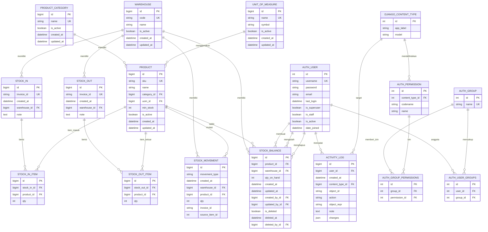

```mermaid
erDiagram
    PRODUCT_CATEGORY ||--o{ PRODUCT : memiliki
    UNIT_OF_MEASURE ||--o{ PRODUCT : menggunakan

    WAREHOUSE ||--o{ STOCK_IN : memiliki
    WAREHOUSE ||--o{ STOCK_OUT : memiliki
    WAREHOUSE ||--o{ STOCK_MOVEMENT : memiliki
    WAREHOUSE ||--o{ STOCK_BALANCE : memiliki

    STOCK_IN ||--o{ STOCK_IN_ITEM : berisi
    STOCK_OUT ||--o{ STOCK_OUT_ITEM : berisi

    PRODUCT ||--o{ STOCK_IN_ITEM : item_masuk
    PRODUCT ||--o{ STOCK_OUT_ITEM : item_keluar

    PRODUCT ||--o{ STOCK_MOVEMENT : mutasi
    PRODUCT ||--o{ STOCK_BALANCE : saldo

    AUTH_USER ||--o{ ACTIVITY_LOG : mencatat
    DJANGO_CONTENT_TYPE ||--o{ ACTIVITY_LOG : target

    DJANGO_CONTENT_TYPE ||--o{ AUTH_PERMISSION : mendefinisikan
    AUTH_GROUP ||--o{ AUTH_GROUP_PERMISSIONS : memberi_izin
    AUTH_PERMISSION ||--o{ AUTH_GROUP_PERMISSIONS : izin

    AUTH_USER ||--o{ AUTH_USER_GROUPS : anggota
    AUTH_GROUP ||--o{ AUTH_USER_GROUPS : mencakup

    AUTH_USER ||--o{ STOCK_BALANCE : membuat
    AUTH_USER ||--o{ STOCK_BALANCE : mengubah
    AUTH_USER ||--o{ STOCK_BALANCE : menghapus

    STOCK_IN {
        bigint id PK
        string invoice_id UK
        datetime created_at
        bigint warehouse_id FK
        text note
    }

    STOCK_OUT {
        bigint id PK
        string invoice_id UK
        datetime created_at
        bigint warehouse_id FK
        text note
    }

    WAREHOUSE {
        bigint id PK
        string code UK
        string name
        boolean is_active
        datetime created_at
        datetime updated_at
    }

    PRODUCT_CATEGORY {
        bigint id PK
        string name UK
        boolean is_active
        datetime created_at
        datetime updated_at
    }

    UNIT_OF_MEASURE {
        bigint id PK
        string name UK
        string symbol
        boolean is_active
        datetime created_at
        datetime updated_at
    }

    PRODUCT {
        bigint id PK
        string sku UK
        string name
        bigint category_id FK
        bigint uom_id FK
        int min_stock
        boolean is_active
        datetime created_at
        datetime updated_at
    }

    STOCK_IN_ITEM {
        bigint id PK
        bigint stock_in_id FK
        bigint product_id FK
        int qty
    }

    STOCK_OUT_ITEM {
        bigint id PK
        bigint stock_out_id FK
        bigint product_id FK
        int qty
    }

    STOCK_MOVEMENT {
        bigint id PK
        string movement_type
        datetime created_at
        bigint warehouse_id FK
        bigint product_id FK
        int qty
        string invoice_id
        int source_item_id
    }

    STOCK_BALANCE {
        bigint id PK
        bigint product_id FK
        bigint warehouse_id FK
        int qty_on_hand

        datetime created_at
        datetime updated_at

        bigint created_by_id FK
        bigint updated_by_id FK

        boolean is_deleted
        datetime deleted_at
        bigint deleted_by_id FK
    }

    ACTIVITY_LOG {
        bigint id PK

        bigint user_id FK
        datetime created_at

        bigint content_type_id FK
        string object_id

        string action
        string object_repr
        text note
        json changes
    }

    DJANGO_CONTENT_TYPE {
        int id PK
        string app_label
        string model
    }

    AUTH_PERMISSION {
        int id PK
        int content_type_id FK
        string codename
        string name
    }

    AUTH_GROUP {
        int id PK
        string name UK
    }

    AUTH_GROUP_PERMISSIONS {
        int id PK
        int group_id FK
        int permission_id FK
    }

    AUTH_USER {
        int id PK
        string username UK
        string password
        string email
        datetime last_login
        boolean is_superuser
        boolean is_staff
        boolean is_active
        datetime date_joined
    }

    AUTH_USER_GROUPS {
        int id PK
        int user_id FK
        int group_id FK
    }
```
